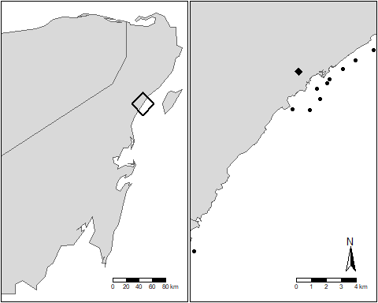
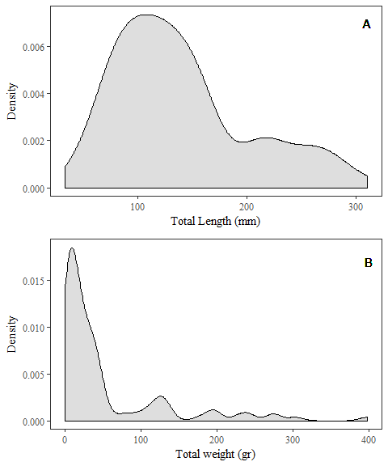
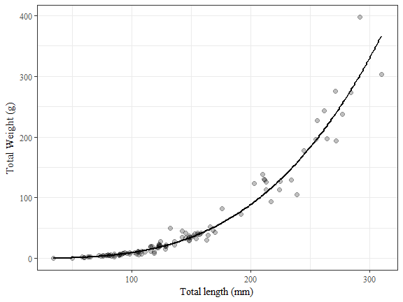

# Biometry of the invasive lionfish (	extit{Pterois volitans}) in the Central Mexican Caribbean, and a review of allometric growth parameters across the invasion range

Juan Carlos VILLASEÑOR-DERBEZ^1^

^1^ Bren School of Environmental Sciences and Management, University of California Santa Barbara, Santa Barbara, California, U.S.

\* Correspondence: Juan Carlos Villaseñor-Derbez, Bren Hall, University of California at Santa Barbara, 
Santa Barbara, CA, 93106, US phone: +1 207 205 8435, e-mail: jvillasenor@bren.ucsb.edu

\clearpage

**Background.** Lionfish (*Pterois volitans/miles*) are an invasive species in the North-Western Atlantic and the Caribbean. In order to better manage the invasion, inform lionfish removal programs, predict their possible impacts, and estimate biomass available for harvest, we must be able to accurately estimate their total biomass. This work had two main objectives: i) identify important spatial patterns in lionfish length-weight relationships across the invasion range; and ii) provide a new pair of site-specific parameters for the Mexican Caribbean. Additionally, guidelines on reporting allometric parameters are provided as a suggestion for future research are provided.

**Materials and methods.** A total of 109 lionfish were sampled from 10 locations in the Mexican Caribbean in 2010. Total Length (TL) and Total weight (TW) were log10-transformed to fit a linear model to the data. The model was fit using Ordinary Least Squares and Heteroskedastik-robust standard errors. Other 13 length-weight relationships from eight peer-reviewed studies and FishBase were used to calculate expected biomass from the observed lengths. Expected-to-observed biomass ratio was calculated for each organism, and a one-way, two-tailed ANOVA was used to test for differences in means across sites. Tukey's HSD was used as a post-hoc test to identify groups of non-statistically significant differences.

**Results.** This study reports a new pair of allometric growth parameters ($a = 3.2056\times 10^{-6}; b = 3.235$) for organisms sampled in the central portion of the Mexican Caribbean. It also identifies that, for a given length, organisms from the Caribbean tend to have lower weights than those from the Gulf of Mexico and Atlantic, indicating that weight-at-length is spacialy variable. Mean expected-to-observed biomass ratios by study ranged between 0.98 and 1.75, with overall values ranging from 0.44 to 3.51.

**Conclusion.** The large differences between observed and expected biomass when using parameters from other locations highlights the importance of using site-specific parameters to estimate biomass from length observations. Findings from this work can aid managers and decision makers to better select length-weight parameters where these are not available for their specific location.

**Key words**   
lionfish, Pterois volitans, length-weight relationship, allometric growth, Mexico

\clearpage

# INTRODUCTION

At least 84% of the marine eco-regions have reported the presence of an invasive species [@molnar_2008]. These represent a major threat to local biodiversity and the economic activities that depend on it, like tourism or fisheries [@bax_2003]. Invasive species may also threaten native species through competition [@davis_2003] or predation. By 2005, the economic cost of invasive species to the United States was  estimated at \$120 billion per year and nearly 42% of species that have been included in the Endangered or Threatened species list have been labeled as such due to presence of invasive species [@pimentel_2005]. This highlights the importance of understanding, managing, and preventing ecological invasions.

Lionfish (*Pterois volitans/miles* complex) are an invasive species in the North-Western Atlantic and the Caribbean, likely introduced through liberation of aquarium-kept organisms [@betancurr_2011]. They are the first marine vertebrates to establish in North Atlantic [@schofield_2009; @schofield_2010] and Caribbean coasts [@sabidoitza_2016]. Lionfish have been widely reported in coral reefs [@aguilarperera_2010], but also in other habitats such as estuaries [@jud_2011], mangroves [@barbour_2010], areas with hard-bottoms [@muoz_2011], and mesophotic reefs [@andradibrown_2017]. Due to its threat to local biodiversity, the speed of their spread, and its difficulty of management, their presence in these waters has been labeled as a major marine invasion  [@hixon_2016].

A significant amount of research has been done to describe lionfish feeding ecology in North Carolina [@muoz_2011], the Bahamas [@morris_2009; @cote_2013], Northern Gulf of Mexico [@dahl_2014], Mexican Caribbean [@valdezmoreno_2012; @villaseorderbez_2014], Belize [@hackerott_2017], and Costa Rica [@sandel_2015]. Their feeding behavior and high consumption rates can reduce recruitment [@albins_2008] and population sizes [@green_2012] of native reef-fish species, and further the endangerment of critically endangered reef fish [@rocha_2015]. (However, see @hackerott_2017 for a case where there was no evidence that lionfish affected the density, richness, or composition of prey fishes). Major efforts have also been made to understand the possible impacts of the invasion by keeping track of its range through time [@schofield_2009; @schofield_2010] and predicting invasion ranges under climate change scenarios [@grieve_2016]. By combining information from these disciplines, researchers have been able to predict the trophic impacts of lionfish [@ariasgonzalez_2011], which can then be translated into ecosystem-level and economic impacts.

Seeking to reduce lionfish densities, governments and non-profit organizations have promoted removal programs and incentivized its consumption [@chin_2016]. In some cases, these have shown to significantly reduce -but not quite eliminate- lionfish abundances at local scales [@sandel_2015, @chin_2016, @deleon_2013]. The rapid recovery rates exhibited by lionfish [@barbour_2011] and the persistent populations in mesophotic coral ecosystems [@andradibrown_2017] -which can contribute with recruitment to shallow-water populations- make of complete eradication through fishing effort an unlikely solution. However, further incentivizing its consumption might create a demand big enough to promote and sustain a stable fishery [@chin_2016], which can reduce local abundances and control -not eradicate- the invasion while providing alternative livelihoods.

The feasibility of lionfish removal programs has been extensively evaluated through field observations[@usseglio_2017; @sandel_2015, @chin_2016, @deleon_2013] and empirical modeling [@barbour_2011; @morris_2011; @johnston_2015]. The latter measure changes in biomass or density [@barbour_2011; @johnston_2015] in response to increased mortality (*i.e.* lionfish removal). In this case, biomass represents the sum of all fish's individual weight. Total Weight (TW) can be estimated from Total Length (TL) observations using the allometric growth equation ($TW = aTL^b$). Parameters $a$ and $b$ for this equation exist for North Carolina [@barbour_2011], Northern [@fogg_2013] and Southern Gulf of Mexico [@aguilarperera_2016], the Southern Mexican Caribbean [@sabidoitza_2016], Little Cayman [@edwards_2014], Jamaica [@chin_2016], Bonaire [@deleon_2013] and Costa Rica [@sandel_2015], but remain unavailable for the central Mexican Caribbean. The weight-at-length of a species can vary across regions as a response to biotic (*e.g.* local food availability) and abiotic (*e.g.* water temperature) conditions [@johnson_2016]. Thus, when using biomass-informed models or estimating biomass from length observations, it is important to use site-specific parameters to obtain an accurate estimate. This is especially important when research involves identifying the total biomass available for harvest by fishers [@chin_2016] or the efficacy of lionfish removals [@barbour_2011; @morris_2011; @johnston_2015].

Here, I provide the first allometric growth parameters for the invasive lionfish in the central Mexican Caribbean region. At the same time, I highlight the importance of using site-specific parameters by estimating biomass with parameters from other regions across the invasion range and comparing them to observed biomass. I also provide other 13 standardized parameters from eight studies through the invasion range, making them readily accessible for future research. Finally, I discuss the way in which allometric parameters are reported, and call for standardization to facilitate their use.

# MATERIALS AND METHODS

**Area of study.** The study took place off the coasts of Playa del Carmen, in the Mexican Caribbean (**Fig. 1**). The region represents the northernmost section of the Mesoamerican Barrier Reef System [@ruizzarate_2004]. Coral reefs and mangroves are locally important habitats that represent important sources of income in terms of extractive (*e.g.* recreational fishing) and non-extractive (*e.g.* SCUBA diving) activities related to tourism, the main source of income to the local economy [@murray_2007].

In the region, the reef profile has been described by @ariasgonzalez_1998, indicating that the reef lagoon extends about 500 m from the coast, until the reef crest is reached. The reef becomes deeper, leading to the reef front often found at 700 m from the coastline end extends for an additional 300 m. At approximately 1000 m away from shore and 30 - 40 m depth, the reef leads to a drop-off. Along a perpendicular profile to the coast, bands of reef are interrupted by sand patches at 8 - 12 m deep and 16-18 m deep. Along the coast, these reefs have been reported to be under significant anthropogenic pressure, likely causing a shift in structure and function [@bozec_2008].

**Fish sampling.** Organisms sampled by @villaseorderbez_2014 for stomach content analysis between May and August of 2010 were used in this work. A total of 33 SCUBA immersions were performed in 10 sampling sites along the coast (Fig. 1, Table 1). Sampling locations included wall and carpet reefs at depths between 5.7 m and 38.1 m.  All observed organisms (n = 109) were collected using hand nets and numbered collection bottles. The use of hand nets prevents any weight loss due to bleeding(when collected with spears), and increases the range of sizes that can be sampled, providing a representative sample of the population. Information on depth and other comments were recorded in an underwater slide. Depth was recorded by dive gauges held by divers as safety procedures during the collections. Samples were frozen within 30 minutes of completing the dive and stored for posterior analysis in the lab. For every organism Total Length (TL; mm) and Total Weight (TW; gr) were recorded in the lab.

**Data analysis.** The weight at length relationship between the observed variables is described by the allometric growth function:

$$TW = aTL^b$$

Where $TW$ is the Total Weight (gr), $TL$ is the observed Total Length (mm), $a$ is the ponderal index and $b$ is the scaling exponent or allometric parameter. When $b = 3$, it is said that the organism exhibits a perfect isometric growth. The dependent and independent variables were transformed via base-10 logarithms so that the equation is then:

$$log_{10}(TW) = b\times log_{10}(TL) + log{10}(a)$$

To simplify this equation, we can re-write it as:

$$Y = mX + c$$

Where $Y = log_{10}(TW)$, $X = log_{10}(TL)$, $m = b$, and $c = log_{10}(a)$. Since $b == m$, we will only use $b$ throughout the paper for simplicity. The coefficients ($c$ and $b$) were estimated with  an Ordinary Least Square Regression and heteroskedastic-robust standard errors. Both coefficients were tested against the null hypothesis of no change (*i.e.* $H_0: c = 0$ and $H_0: b = 0$). Additionally, the allometric parameter was tested against the null hypothesis of isometric growth ($H_0: b = 3$). Coefficients were tested with a two-tailed Student's t-test. The significance of the regression was corroborated with an F-test.

Other allometric growth parameters were obtained from peer-reviewed literature. Parameters were obtained for North Carolina [@barbour_2011], Northern [@fogg_2013] and Southern Gulf of Mexico [@aguilarperera_2016], the Southern Mexican Caribbean [@sabidoitza_2016], Little Cayman [@edwards_2014], Jamaica [@chin_2016], Bonaire [@deleon_2013] and Costa Rica [@sandel_2015]. Additionally, parameters from Fishbase [@froese_website_2016] were also included. When available, information on sampling methods, gender differentiation, location, and depth ranges of each study was retrieved. Whenever gender was not specified, it was assumed that the results were presented for both genders pooled together. During the review process, it was noticed that some papers indistinctly use $a$ to report either the ponderal index in eq. 1 or the y-intercept ($c$) in eq. 3, which might sometimes be overlooked. Furthermore, some studies report their parameters as mm-to-gr conversions, but a rapid evaluation of such parameters indicates that they were estimated as cm-to-gr conversions. Here, all parameters are reported as TL(mm) to TW(gr) conversions. When required, values from other studies are transformed for consistency.

Since standard errors or confidence intervals were not provided for many studies, it was impossible to test for statistical differences between coefficients. Thus expected biomass for each organism was calculated with the growth parameters estimated in this study, as well as those retrieved from additional literature. All expected biomass values were divided by the observed biomass to obtain a ratio that allowed rapid identification of over- or underestimation with respect to the observed biomass. Therefore, values lower than 1 indicate that the parameters underestimate biomass, and values larger than 1 indicate overestimation. Median and mean expected to observed biomass ratios were calculated for each study. Difference in mean biomass ratios across studies were tested with an two-tailed, one-way Analysis of Variance (ANOVA).

All hypothesis testing was performed with a confidence level of $\alpha = 0.01$ in R version 3.4.0 [@rcore_2017]. Data wrangling was performed with the tidyverse package [@tidyverse_2017]. Maps were created with a mix of functions from the sp [@sp_2017], rgdal [@rgdal_2017], tmap [@tmap_2017], and tmaptools [@tmaptools_2017] packages. Calculation of heteroskedastic-robust standard errors was done with the sandwich [@sandwich_2014] and lmtest [@lmtest_2002] packages. Models were manipulated with with the broom package [@broom_2017]. Stargazer [@stargazer_2015], knitr [@knitr_2017], and kableExtra [@kableExtra_2017] were used to produce the tables, and RefManageR [@RefManager_2014] was used to keep track of citations. The manuscript was written in r markdown [@rmarkdown_2017] and processed with the knitr package [@knitr_2017]. Raw data and code used in this work is available at [github.com/jcvdav/lionfish_biometry](github.com/jcvdav/lionfish_biometry).

# RESULTS

Organism TL ranged between 34 and 310 mm and TW between 0.3 and 397.7 gr. The smallest organism (TL = 34.00 mm) was also the lightest organism (TW = 0.30 gr). However, the largest organism (TL = 310.00 mm) was not the heaviest (TW = 303.70 gr), and the heaviest organism (TW = 397.70 gr) was 292.00 mm in total length. Kernell density plots (Fig. 2) show the distribution for TL and TW. Both measures were positively skewed, with skewness of 0.87 for TL and 2.25 for TW.

**Length-weight relationship.** The model adjusted to eq. 3 estimated the coefficient values at $b = 3.2347391$ and $c = -5.4940866$. Thus, TW (gr) can be calculated from TL (mm) as a linear equation: $log_{10}(TW) = 3.2347391\times log_{10}(TL) -5.4940866$ or its exponential form: $TW = 3.2056297\times 10^{-6}\times TL^{3.2347391}$. The intercept ($c$) and slope $(b)$ were significantly different from zero ($t(107) = -66.17; p<0.01$ and $t(107) = 83.24; p<0.01$, respectively), rejecting the null hypothesis of no change. Additionally, the allometric factor ($m = b$) was significantly different from the value of isometric growth of $b = 3$ ($t(107) = 6.04; p<0.01$), indicating that lionfish present allometric growth. More information on model fit and confidence intervals for the estimated coefficients is presented in Table 2. The relationship between Total Length and Total Weight is presented in Figure 3.

**Comparison of allometric parameters.** From the eight peer-reviewed studies including information on growth parameters for *P. volitans* and Fishbase [@froese_website_2016], 13 parameters were identified (Table 3). Two studies [@aguilarperera_2016; @fogg_2013] reported gender-level and pooled parameters, while the rest of the studies always presented pooled results. The smallest coefficient of determination was presented by @chin_2016 with $R^2 = 0.8715$, while @sabidoitza_2016 reported the highest value at $R^2 = 0.9907$. These studies presented information for organisms obtained at depths between 0.5 and 57 m. Two studies [@aguilarperera_2016; @chin_2016] explicitly stated that their organisms were sampled with pole spears. Five studies [@sandel_2015; @barbour_2011; @fogg_2013; @edwards_2014; @sabidoitza_2016] mentioned that some of their organisms were obtained with pole spears (or other type of harpoon). A single study [@deleon_2013] did not specify how samples were obtained.

Parameters from models fit to males or females exclusively tend to have a higher steepness (*i.e.* higher allometric parameter), with mean $\pm$ standard deviation values of $b = 3.27 \pm 0.06$ and $b = 3.31 \pm 0.23$ for males and females respectively, compared to parameters from models for pooled genders with a mean $\pm$ standard deviation value of $b = 3.09 \pm 0.22$. In the case of the ponderal index ($a$) and its $log_{10}$ transformed parameter ($c$), values were higher for parameters for pooled genders. Figure 4 shows the predicted weights for organisms within the size range of these study using the 14 parameters previously described.

There were significant differences in expected-to-observed biomass ratios computed for each pair of parameters (F(13, 1512) = 39.28; p < 0.05). From all allometric parameters reviewed, those of @edwards_2014 provided the lowest biomass estimates, with an expected-to-observed biomass ratio of 0.98 $\pm$ 0.23 (mean $\pm$ SD). On the other hand, @barbour_2011 yielded the highest biomass estimates, with a mean ($\pm$ SD) expected-to-observed biomass ratio of 1.76 $\pm$ 0.50. Predicted-to-observed biomass ratios and groups identified by Tukey's HSD ($\alpha = 0.05$) are presented in Figure 5.

# DISCUSSION

This study provides the first pair of allometric growth parameters specific to the Central Mexican Caribbean, complementing other studies performed in Mexican waters in the Alacranes Reef [@aguilarperera_2016] and Xcalak National Park [@sabidoitza_2016]. By using hand nets instead of spears, we are able to sample a wider range of sizes often ignored by pole spear samples, allowing us to include smaller organisms. Estimating parameters by including smaller organisms ensures better estimatio of weight for smaller sizes. This is especially important when biomass is calculated from visual census, where small organisms can be registered. Thus, this study is the first to provide allometric growth parameters for lionfish in the central region of the Mexican Caribbean and increases certainty in weight estimation of small organisms.

The length-eight coefficients estimated in this study were within the range identified by studies in other regions [@barbour_2011; @fogg_2013; @aguilarperera_2016; @sabidoitza_2016; @edwards_2014; @chin_2016; @deleon_2013; @sandel_2015]. However, the ones presented here provide lower weight estimates for a same length. Until about TL = 200 mm, there are no appreciable differences between the parameters for organisms from the Mexican Caribbean and those for little Cayman [@edwards_2014] and Jamaica [@chin_2016]. Yet, for larger organisms (TL > 270 mm) parameters from Costa Rica [@sandel_2015] and Bonaire [@deleon_2013] provide similar estimates to those from this study. Conversely, these same studies tend to overestimate weight -as compared to the ones reported here- for smaller organisms, likely due to the lack of small organisms in the samples used to estimate their parameters. When ever possible, future works should consider the use of hand nets to obtain the samples not only for studies on weight-at-length, but also diet, behavior and life history, where length can be an important factor.

There are evident differences in weight-at-length between organisms from the Caribbean and Gulf of Mexico / North-Western Atlantic. Weight estimates with parameters from the Gulf of Mexico and North-Western Atlantic [@barbour_2011; @fogg_2013; @aguilarperera_2016; @sabidoitza_2016] tend to be higher than those from the Caribbean [@edwards_2014; @chin_2016; @deleon_2013; @sandel_2015], except for the ones from Xcalak National Park, Mexico [@sabidoitza_2016]. This indicates that there are differences between lionfish across the invasion range, pattern that has also been reported for age and growth parameters [@fogg_2015]. These differences can have major implications in management, especially when estimating biomass available for harvest or predicting effects on local ecosystems, or evaluating the effectiveness of removal programs. Using site-specific values provides a more accurate estimate of fish biomass. Future research should try to use, to the extent possible, parameters calculated for their region, or use different parameters to provide upper and lower bounds in their results. At the same time, this highlights the need for more basic research. To have a better invasion management, we must perform research that can describe biologically important information of lionfish throughout its invasion range [@johnson_2016].

While performing the literature review, it was often unclear if parameters were presented for eq.1 or eq. 3. Sometimes, they were even mislabeled and yielded senseless results when using the suggested conversion equation. On some others, parameters were said to be reported for mm to gr conversions, when they were actually reported as cm to gr conversions. Perhaps these minor discrepancies can be easily solved by any researcher, but why should they exist in the first place? It is important that we report our information in a standard way, making it readily available for other researchers and managers. In this particular case, I provide my humble opinion through 5 guidelines to report allometric parameters:

1. Be explicit in the methods section. What may seem obvious to you as an author -because you have been deeply immersed throughout the process- may not be clear to the reader. Specify any transformation performed on the data. When using log-transformations, mention the base used to transform. Do not assume that "data were log-transformed" means $log_{10}(X)$. These assumptions vary across disciplines and software and can be a source of confusion. For example, in biology we often assume "log-transformed" indicates the use of base 10, however in R the proper command is `log10()` and not `log()`, which uses base $e$.

2. Use mm and gr to measure TL and TW, respectively. While conversion is always possible, we should aim at using standard units to report these parameters. If you prefer to use cm to gr conversions, that is certainly valid, but make sure to explicitly mention units when presenting the parameters.

3. Specify the equation for which parameters are presented by including an explicit example with the parameters substituted into it, as done by some of the papers reviewed [@chin_2016; @sandel_2015; @deleon_2013; @sabidoitza_2016]. If possible, present the parameters in their exponential (eq. 1) and linear (eq. 3) forms.

4. Report standard errors and/or confidence intervals around the obtained estimates. Given that small changes in $a$, $c$,  and $b$ can result in important changes in estimated weight, it is important that we report uncertainty around each parameter and not just general model fit and significance. Reporting uncertainty around parameters allows researchers and managers to include upper and lower bounds in their predictions.

5. Make your data -and code- available. Even if this is not requited by the journal or publisher, you can use free cloud data storage services or third-party repositories to make your research accessible to others. Resources will always be limited and budget will never be enough. It is important that we take advantage of open science tools that promote the advancement of knowledge and foster collaboration. Ultimately, this promotes transparency allows replicability of research and advances science.

This study provides a new pair of allometric growth parameters are provided for lionfish from the central Mexican Caribbean, where they exhibit different weight-at-length, as compared to other regions. Given the differences in weight-at-length patterns throughout the invasion range, it is important to use site-specific parameters. Managers and scientist should make every possible effort to use site-specific parameters.

# AKNOWLEDGEMENTES

I would like to thank thank Nils Van Der Haar and Michael Doodey from Dive Aventuras as well as Guillermo Lotz-Cador who provided help to collect samples. I would also like to (anticipatedly) thank the editor and reviewers, who significantly improved the quality of this work. This research was partially funded by the "Consejo Nacional de Ciencias y Tecnología" (CONACyT) and the Latin American Fisheries Fellowship Program.

\clearpage

# REFERENCES

\clearpage

\clearpage

# TABLES

Table 1: Coordinates, minimum, maximum and mean depth (m), and number of samples for each location.

Location    Lat.     Long.     Min. Depth   Max. Depth   Mean Depth      n
----------  -------  --------  -----------  -----------  -----------  ----
Canones     20.477   -87.233   15.0         31.2         21.6           11
Castillo    20.496   -87.220   12.5         30.5         27.5           18
Cuevitas    20.478   -87.244   7.4          12.8         11.2            4
Islas       20.490   -87.228   14.0         19.4         16.7           10
Paamul      20.513   -87.192   9.9          22.7         15.5           31
Paraiso     20.484   -87.226   9.4          38.1         17.7           16
Pared       20.502   -87.212   12.1         21.0         16.3           12
Pedregal    20.507   -87.204   14.4         14.9         14.7            3
Santos      20.493   -87.222   5.7          26.6         16.2            2
Tzimin-Ha   20.393   -87.307   21.2         24.6         22.9            2
Total                          5.7          38.1         18.6          109

\clearpage

Table 2: Regression table for the linear model fit between log10-transformed Total Weight (dependent variable) and Total Length (independent variable). Numbers in parentheses next to coefficient estimates indicate heteroskedastic-robust standard errors. The asterisks (\*) indicate the statistical significance. 95% Confidence intervals are provided for each parameter.

<table style="text-align:center"><tr><td colspan="2" style="border-bottom: 1px solid black"></td></tr><tr><td style="text-align:left"></td><td><em>Dependent variable:</em></td></tr>
<tr><td></td><td colspan="1" style="border-bottom: 1px solid black"></td></tr>
<tr><td style="text-align:left"></td><td>log10(TW)</td></tr>
<tr><td colspan="2" style="border-bottom: 1px solid black"></td></tr><tr><td style="text-align:left">c</td><td>-5.494 (0.083)***</td></tr>
<tr><td style="text-align:left">b</td><td>3.235 (0.039)***</td></tr>
<tr><td colspan="2" style="border-bottom: 1px solid black"></td></tr><tr><td style="text-align:left">95% CI for c</td><td>(-5.657--5.331)</td></tr>
<tr><td style="text-align:left">85% CI for b</td><td>(3.159-3.311)</td></tr>
<tr><td style="text-align:left">F Statistic</td><td>6928.67*** (df = 1; 107)</td></tr>
<tr><td style="text-align:left">Observations</td><td>109</td></tr>
<tr><td style="text-align:left">Adjusted R2</td><td>0.976</td></tr>
<tr><td style="text-align:left">Residual Std. Error</td><td>0.096 (df = 107)</td></tr>
<tr><td colspan="2" style="border-bottom: 1px solid black"></td></tr><tr><td style="text-align:left"><em>Note:</em></td><td style="text-align:right">*p<0.1; **p<0.05; ***p<0.01</td></tr>
</table>

\clearpage

Table 3: Summary of 13 allometric growth parameters available for lionfish in the invaded range from eight peer-reviewed papers, Fishbase [@froese_website_2016], and this study. All parameters have been adjusted to convert from millimeters to grams. n = Sample size, a = scaling parameter for eq. 1, c = y-intercept for eq. 3, b = exponent or slope for eq. 1 or eq. 3, respectively. The R^2^ column indicates reported model fit. mDepth and MDepth indicate minimum and maximum depths (m), respectively, at which organisms were sampled. The Spear column indicates if the study collected organisms with pole spears. An asterisk (\*) indicates that some portion of organisms were sampled with pole spears. 1 = @aguilarperera_2016, 2 = @sandel_2015, 3 = @chin_2016, 4 = @barbour_2011, 5 = @deleon_2013, 6 = @fogg_2013, 7 = @edwards_2014, 8 = @sabidoitza_2016, 9 = @froese_website_2016, 10 = This study.

 Reference  Sex      a        c         b       R2  n        mDepth   MDepth   Spear 
----------  -------  -----  ---  --------  -------  -------  -------  -------  ------
         1  Both     472      0   -5.5400   3.3000  0.95     5        20       Yes   
         1  Female   67       0   -5.9300   3.4700  0.95     5        20       Yes   
         1  Male     59       0   -5.3800   3.2300  0.95     5        20       Yes   
         2  Both     458      0   -4.4400   2.8100  -        -        -        Yes*  
         3  Both     419      0   -4.5600   2.8500  0.8715   18.3     18.3     Yes   
         4  Both     774      0   -4.5391   2.8900  -        27       45       Yes*  
         5  Both     1450     0   -4.6411   2.8900  0.96     -        -        NA    
         6  Both     582      0   -5.8600   3.4349  0.99     -        -        Yes*  
         6  Male     119      0   -5.5700   3.3100  0.97     -        -        Yes*  
         6  Female   115      0   -5.1700   3.1437  0.94     -        -        Yes*  
         7  Both     1887     0   -5.5229   3.2400  0.97     15       30       Yes*  
         8  Both     2143     0   -5.2828   3.1832  0.9907   0.5      57       Yes*  
         9  Both     NA       0   -5.0293   3.0900  -        -        -        NA    
        10  Both     109      0   -5.4941   3.2347  0.9766   5.7      38.1     No    

\clearpage

# Figures

\clearpage

\clearpage

\clearpage

\clearpage

![. Box and whiskers plot showing the distribution of predicted to observed biomass ratios for 14 pairs of allometric parameters. Lines indicate median values, circles indicate mean values, notches represent 95% confidence intervals arround the median, lower and upper hinges correspond to the first and third quartiles, whiskers extend to the largest and lowes values within 1.5 inter-quartile range of the hinge, small points represent outliers further away than the whiskers. Like letters indicate values that do not differ significantly (Tukey's HSD; p < 0.05).](Manuscript_files/figure-docx/unnamed-chunk-10-1.png)
